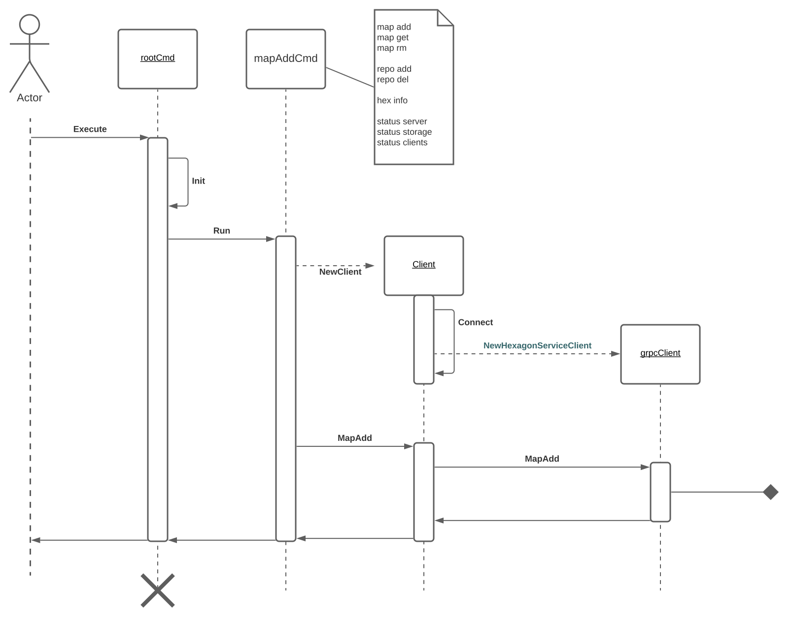

# Overview
Command line interface to manipulate game content

## Commands
### Hexagon manipulation
    nb hex add [0,0,0] [ref]
    nb hex get [0,0,0]
    nb hex update [0,0,0] [ref]
    nb hex del [0,0,0]
### Status hexagon network (storage server, meta data server, connected clients)
    nb status server
    nb status storage
    nb status clients
### Package content
    nb content pack [dir]
    nb content upload [pack]
    nb content download [ref]

## Use with server
Run [`hexcloud`](https://github.com/3vilM33pl3/hexcloud) server. The server listens to 0.0.0.0:8080 by default.

`go run .\cmd\hexcloud\hexcloud.go --local=true`

Test with status command:

`go run nb.go status server`

## Update gRPC proto
```shell
go install google.golang.org/protobuf/cmd/protoc-gen-go
install google.golang.org/grpc/cmd/protoc-gen-go-grpc
protoc --go_out=./internal/pkg  --go-grpc_out=./internal/pkg ./api/hexagon.proto
```

## Program Flow
Program flow of two of the [API call](./api/hexagon.proto) (MapAdd)
